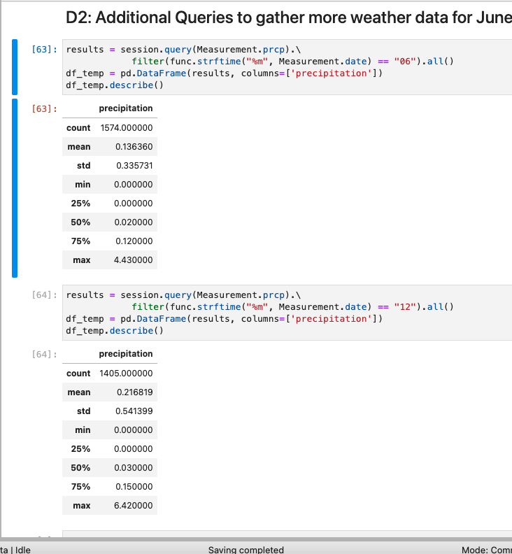

## surfs_up
### Overview of the analysis:
#### W. Avy tells you that he's interested in the most active station; he believes it will provide the most data and help you determine the best location for the surf shop. However, we know that more data doesn't necessarily equate to more accurate results. But W. Avy is passionate about the location—he's convinced that it will provide the best weather for surfing and eating ice cream. For this reason, we provided him an anlysis with the minimum, maximum, and average temperatures of the most active station. Avy was very satisfied with our findings.

### Purpose of the analysis:
#### W.Avy wants more information about temperature trends before opening the surf shop. Specifically, he wants temperature data for the months of June and December in Oahu, in order to determine if the surf and ice cream shop business is sustainable year-round.

### Results:
#### - We find the summary statistics of the temperature data for the month of June and December.
#### - Temperatures are in the mid 70s to mid 80s in June. Ideal for surfing.
#### - In December the temperatures are in the high 60s and mid 70s with the maximum temperature being 83. This is still a good temperature for surfing.

### Summary:
#### We perform further analysis to understand the weather patterns for the month of June and December. We ran the following queries to calculate the precipitation statistics for the month of June and December. Comparing the temperature and the precipitation levels for the month of June and December, we concur that it is good to surf and ice cream business will sustain year-round.

